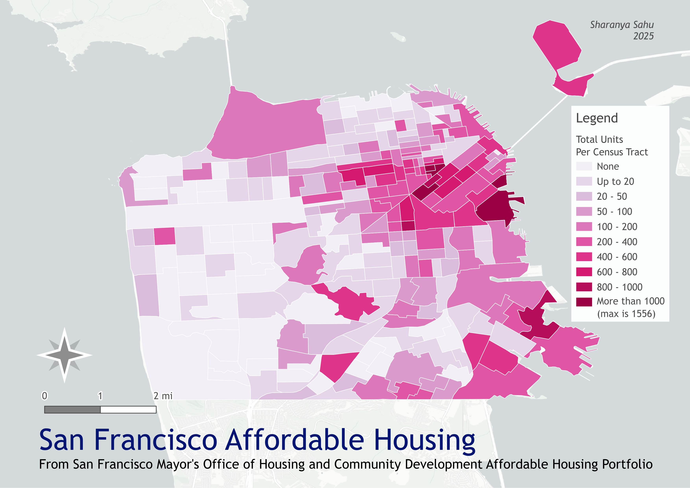

# Housing Affordability in San Francisco

  <a href="index.html">About Me</a>
  <a href="https://docs.google.com/document/d/e/2PACX-1vTdXMOxjDVlwPxPEMZ2_DTfDJnAC52xALzhIjLUhGW5FnHeF41MyVcPV0RUxzgMhcjNPmRNMxvVOgRB/pub">Resume</a>
  <a href="project.html">Projects</a>
  <a href="paper.html">Papers</a>
  <a href="contact.html">Contact</a>
  <a href="awards.html">Awards</a>

These maps visualize rent burden in San Francisco, alongside point locations of affordable housing in the city. This was prepared as part of a term paper for the course Principles of Housing at Rutgers.

