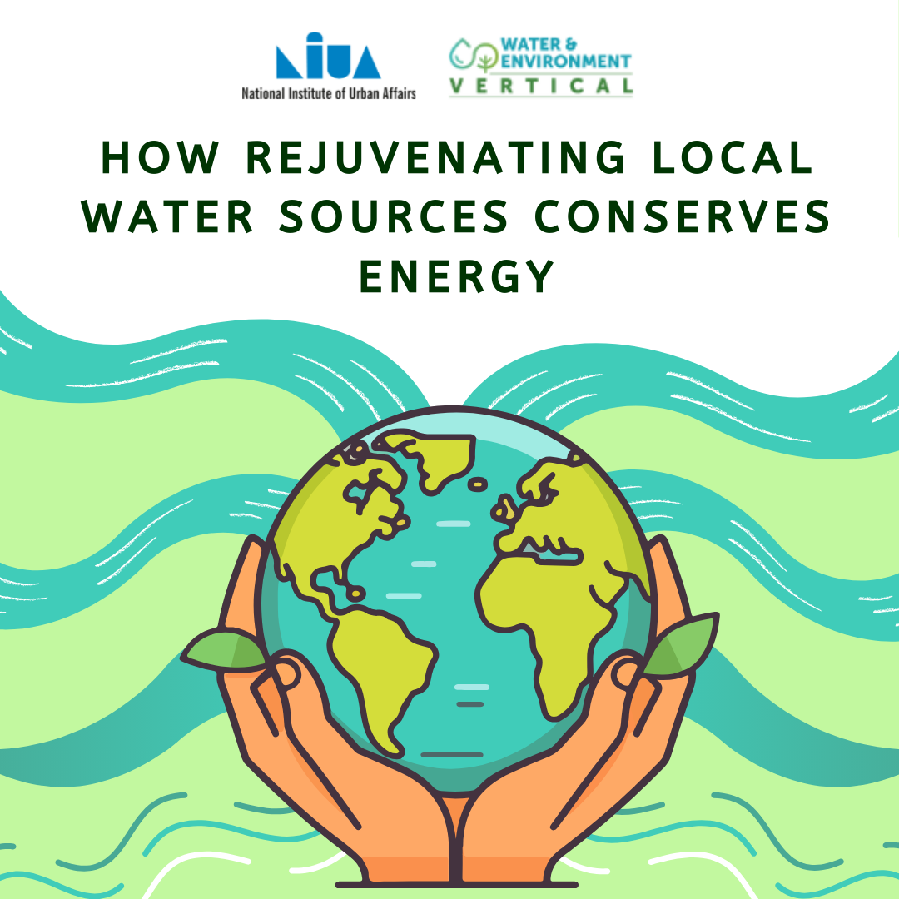
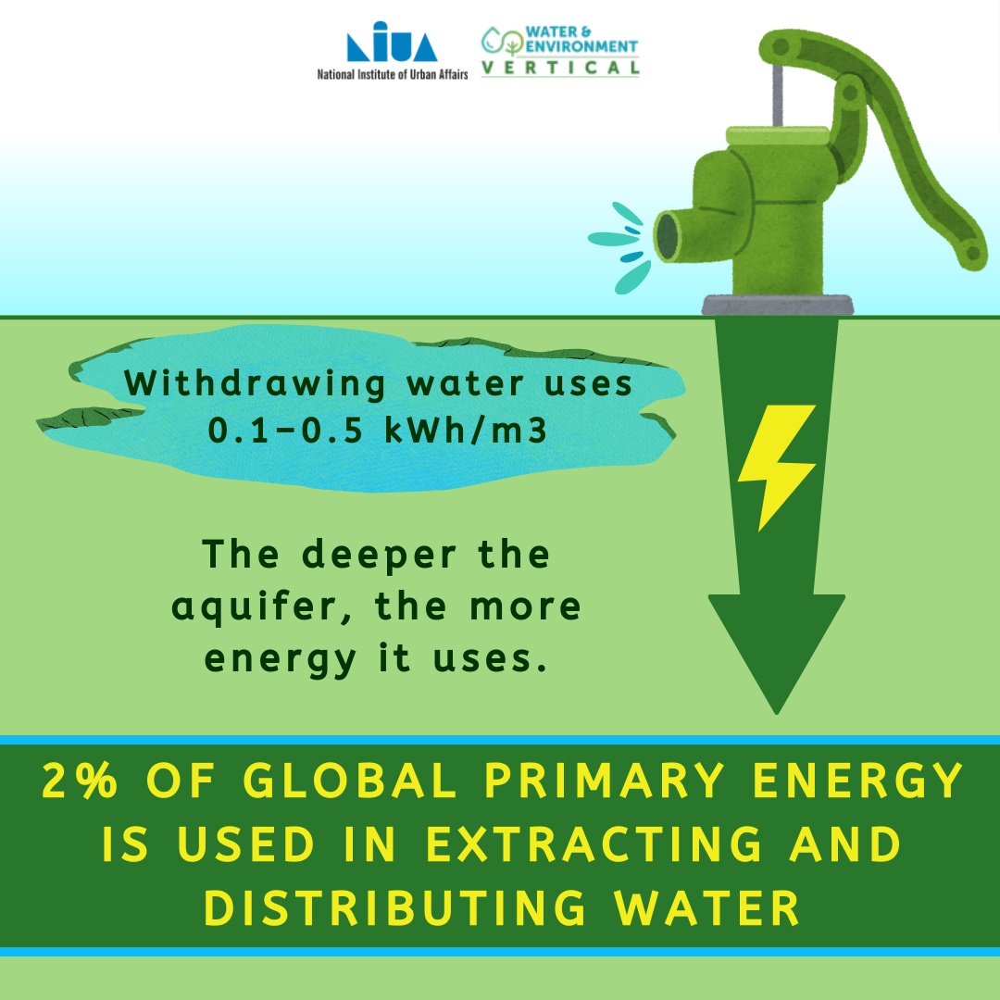

# Earth Day and Shallow Aquifers LinkedIn Post

  <a href="index.html">About Me</a>
  <a href="https://docs.google.com/document/d/e/2PACX-1vTdXMOxjDVlwPxPEMZ2_DTfDJnAC52xALzhIjLUhGW5FnHeF41MyVcPV0RUxzgMhcjNPmRNMxvVOgRB/pub">Resume</a>
  <a href="project.html">Projects</a>
  <a href="paper.html">Papers</a>
  <a href="contact.html">Contact</a>
  <a href="awards.html">Awards</a>

Graphics created for Earth Day 2025 for NIUA's Water and Environment Team. See the full post [here](https://www.linkedin.com/posts/national-institute-of-urban-affairs_worldearthday-ourpowerourplanet-shallowaquifermanagement-activity-7320447664221732866-KUgB?utm_source=social_share_send&utm_medium=member_desktop_web&rcm=ACoAADGvEY8BZ6I9fJrCNoiqxgT2K1Bpeks6I-c).

