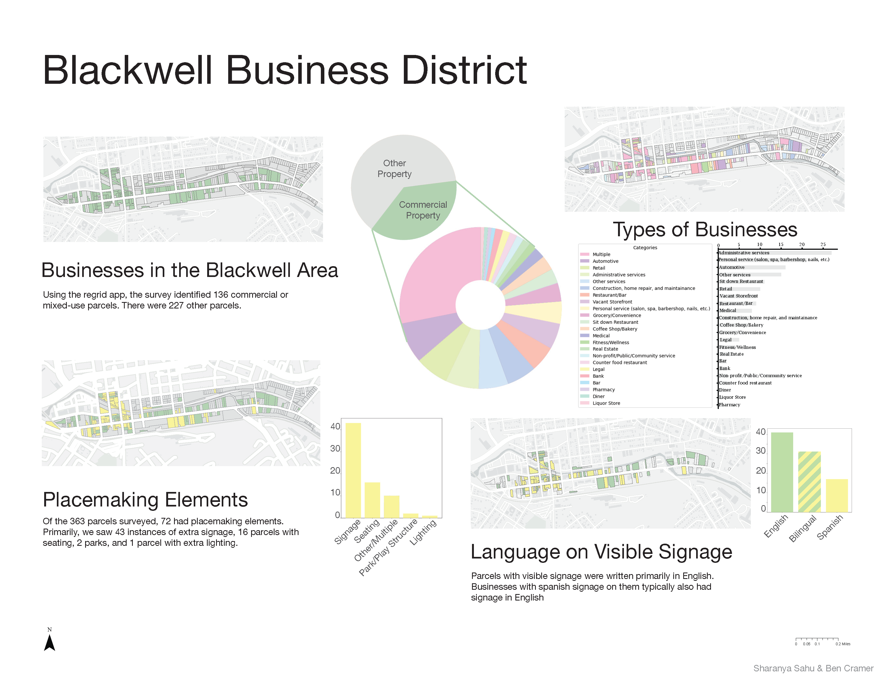
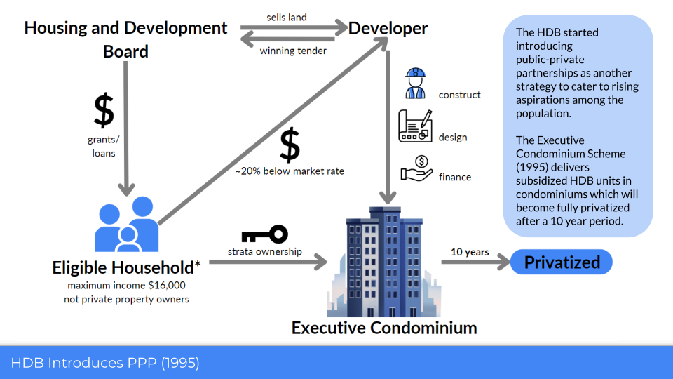

# Welcome to Sharanya Sahu's website!

  <a href="https://docs.google.com/document/d/e/2PACX-1vTdXMOxjDVlwPxPEMZ2_DTfDJnAC52xALzhIjLUhGW5FnHeF41MyVcPV0RUxzgMhcjNPmRNMxvVOgRB/pub">Resume</a>
  <a href="project.html">Projects</a>
  <a href="paper.html">Papers</a>
  <a href="awards.html">Awards</a>
  <a href="contact.html">Contact</a>

My name is Sharanya Sahu, and I aspire to advance affordable and resilient places. I have a background in data analytics and GIS from UC Berkeley, and am a Master of City and Regional Planning student at the Bloustein School of Planning and Public Policy. I am interested in working within and shaping institutional frameworks for public good through the housing and community development sector. At Bloustein, I research affordable housing, environmental resilience, and the role of emerging technologies in these areas. Professionally I have worked in urban environmental policy in India, community development consulting in New Jersey, and community planning in the NYC government. My cross disciplinary and international experience affords me a unique, critical perspective. I seek to bring my experiences, skills, and values wherever I land.
 

- [Rutgers Climate and Energy Fellow](https://rcei.rutgers.edu/rutgers-climate-and-energy-fellowships/)
- [Charlene Conrad Liebau Library Prize for Undergraduate Research](https://www.lib.berkeley.edu/about/news/library-prize-2024)
- [UC Berkeley Undergraduate Research Apprentice Summer Fellow](https://research.berkeley.edu/urap-researchers/sharanya-sahu/)

## Education
- Bloustein School of Planning and Public Policy, Rutgers University New Brunswick (expected 2027) <b>Master of City and Regional Planning </b> 
- UC Berkeley (2024) <b>BA Urban Studies, BA Data Science</b>

## Scroll Through Featured Projects!

  

    

      <a href="https://calsahu.github.io/faith-based-housing/">
        <video src="video/mapvideo.mp4" autoplay muted loop playsinline></video>
      </a>
    

    

      
    

    

      
    

  

  <button class="prev">‹</button>
  <button class="next">›</button>

 
Thank you for visiting my webpage. If you are interested in collaborating, please feel free to [reach out](contact.md)!
