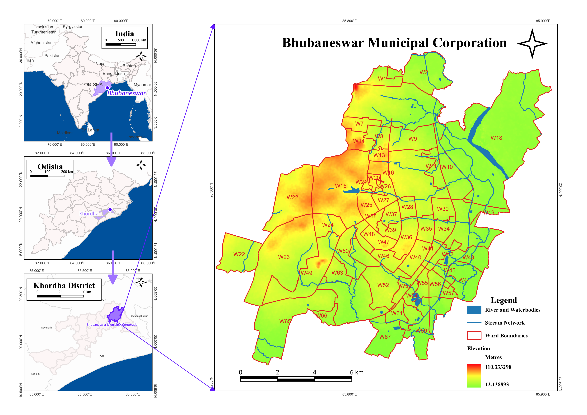
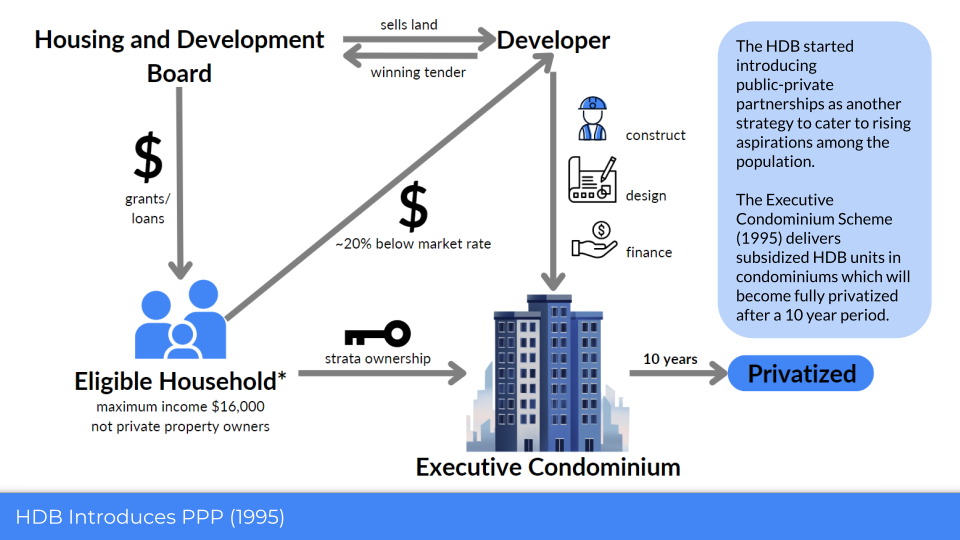
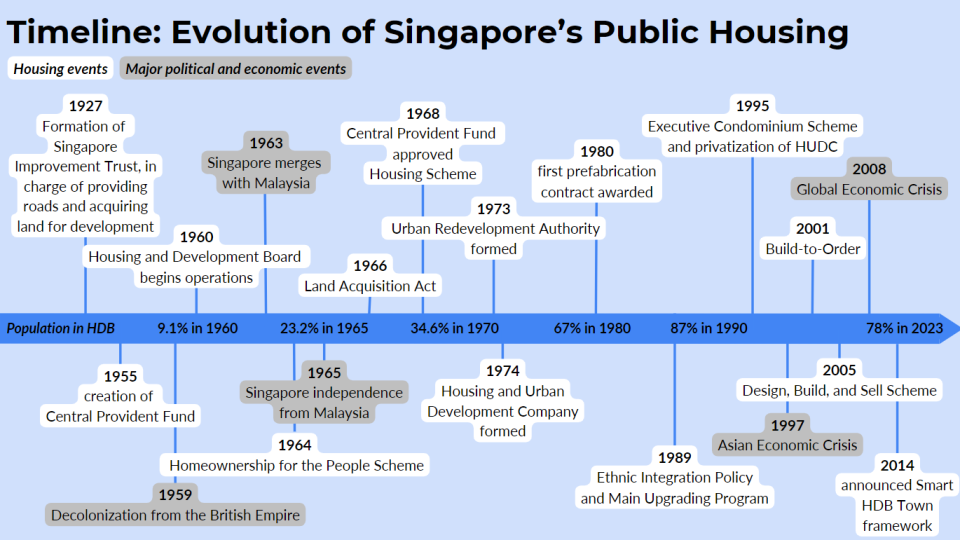
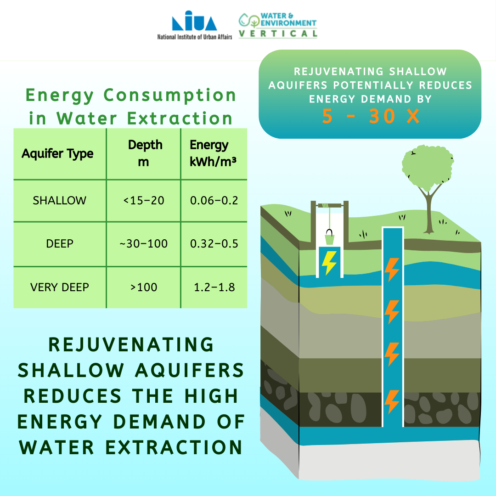
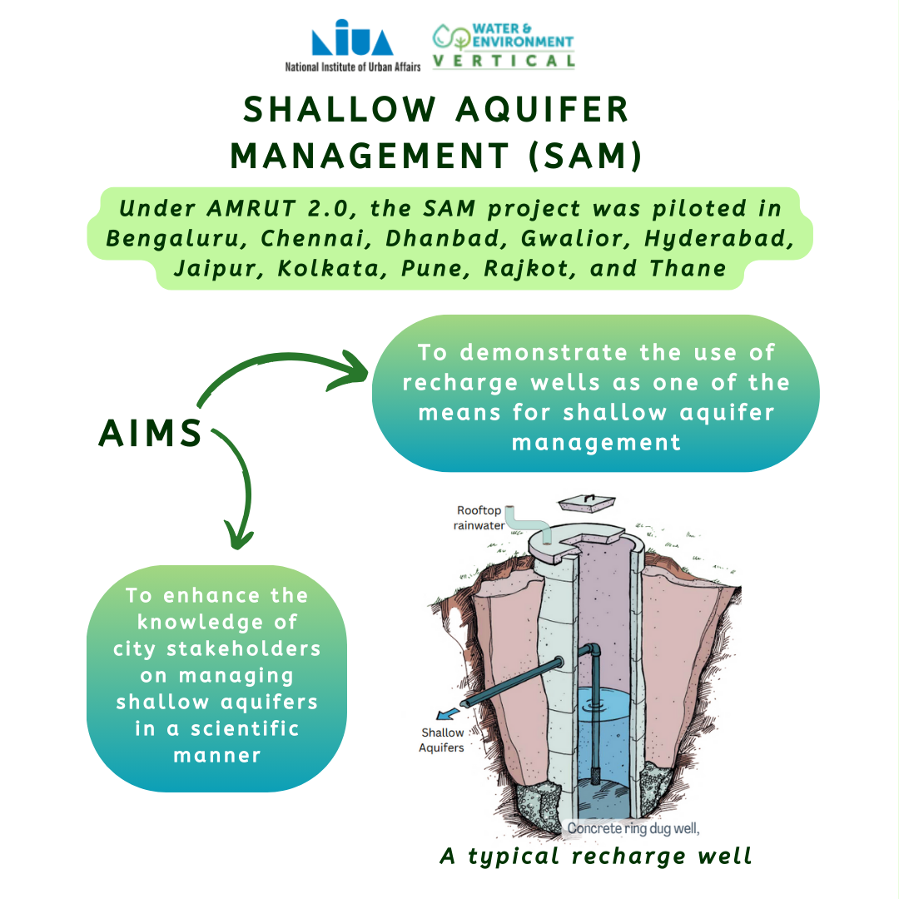

# Projects

## Maps

  

    

      <a href="fbhousing.html">
        <video src="video/mapvideo.mp4" autoplay muted loop playsinline></video>
      </a>
    

    

      
    

    

      
    

    

      
    

  

  <button class="prev">‹</button>
  <button class="next">›</button>

## Data Analysis

  

    

      <a href="fbhousing.html">
        <video src="video/mapvideo.mp4" autoplay muted loop playsinline></video>
      </a>
    

    

      
    

    

      
    

  

  <button class="prev">‹</button>
  <button class="next">›</button>

## Presentations
include HT memo
NITI Aayog work
Class presentations

  

    

      <a href="fbhousing.html">
        <video src="video/mapvideo.mp4" autoplay muted loop playsinline></video>
      </a>
    

    

      
    

    

      
    

  

  <button class="prev">‹</button>
  <button class="next">›</button>

## Graphics
NIUA work

  

    

      <a href="fbhousing.html">
        <video src="video/mapvideo.mp4" autoplay muted loop playsinline></video>
      </a>
    

    

      
    

    

      
    

  

  <button class="prev">‹</button>
  <button class="next">›</button>

### NYC Squirrel Census

<iframe src="squirrel_map_NYC (1).html" height="855" width="95%"></iframe>

### Land Use Change in Doral, Florida

### Bhubhaneswar EPIC Project

### Groundwater Situation of Delhi
Made for NIUA, under the supervision of Dr. Victor Shinde and Banibrata Choudhury.
<iframe src="GWSTRESSDELHI.pdf" width="100%" height="600px"></iframe>
<iframe src="GWRecharge_Parks.pdf" width="100%" height="600px"></iframe>
<iframe src="GWQualityDELHI.pdf" width="100%" height="600px"></iframe>
<iframe src="GWDepthtoLevelDecadalDELHI.pdf" width="100%" height="600px"></iframe>
<iframe src="GWDelhi_Recharge_Waterbodies.pdf" width="100%" height="600px"></iframe>
<iframe src="GWDelhiInfiltrationParks.pdf" width="100%" height="600px"></iframe>
<iframe src="GWDelhiInfiltration.pdf" width="100%" height="600px"></iframe>
<iframe src="GWDelhiDischarge.pdf" width="100%" height="600px"></iframe>
<iframe src="FIXEDBuiltUp.pdf" width="100%" height="600px"></iframe>
<iframe src="DelhiGWDischargeRate.pdf" width="100%" height="600px"></iframe>

## Presentations

### [Singapore Housing Policy](https://docs.google.com/presentation/d/e/2PACX-1vRyHdynAAIsFmzL-_fXcwX4Xq7MC3sf-y63_sA6qIt2kG9CEoo2BLSU0A3chcpHI0d3OmeAAH8jex-j/pub?start=false&loop=false&delayms=3000)

### Earth Day and Shallow Aquifers Instagram Post

