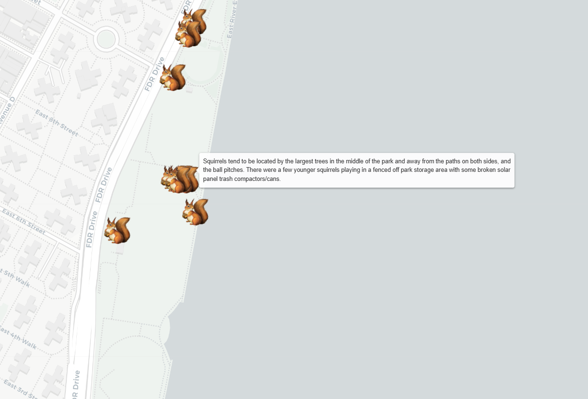
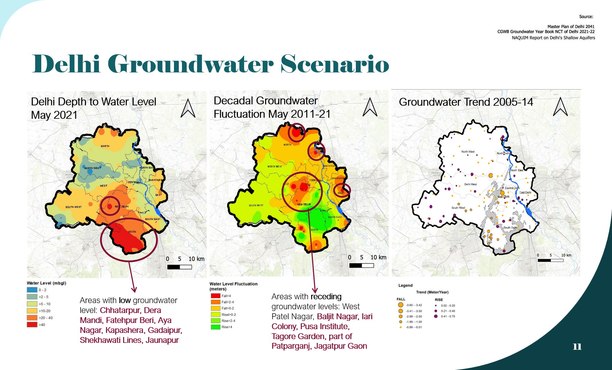
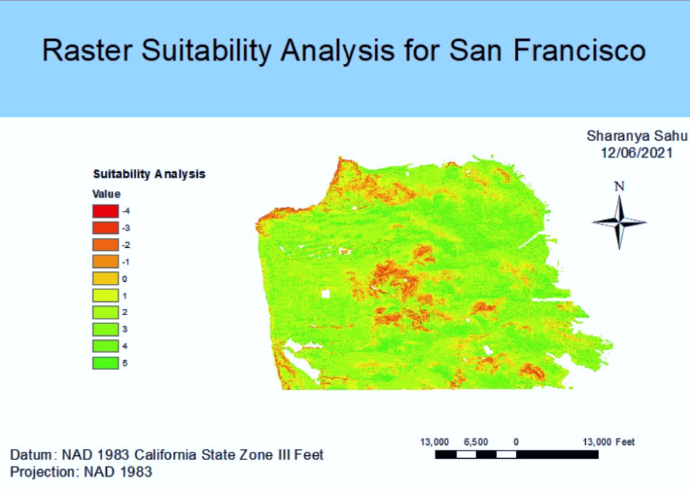
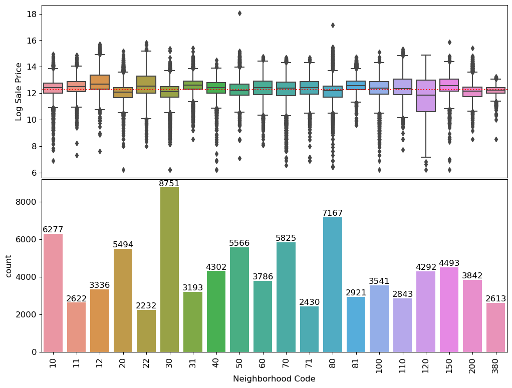
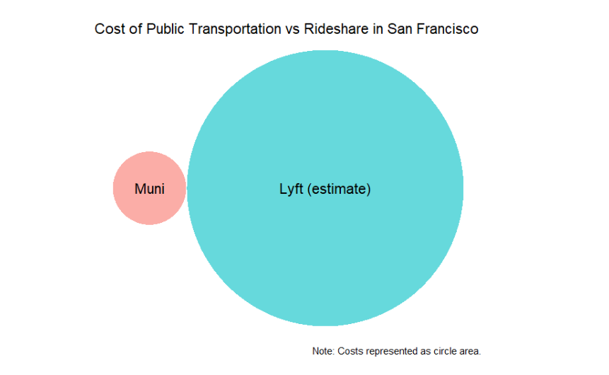
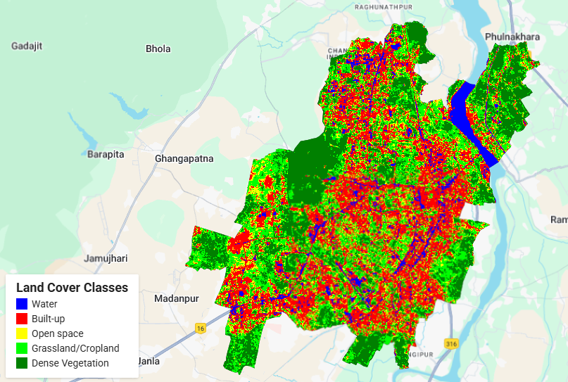
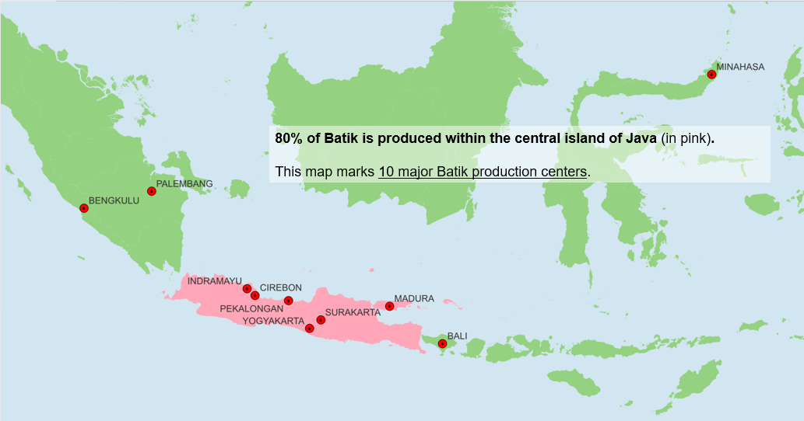

# Projects

  <a href="index.html">About Me</a>
  <a href="https://docs.google.com/document/d/e/2PACX-1vTdXMOxjDVlwPxPEMZ2_DTfDJnAC52xALzhIjLUhGW5FnHeF41MyVcPV0RUxzgMhcjNPmRNMxvVOgRB/pub">Resume</a>
  <a href="paper.html">Papers</a>
  <a href="awards.html">Awards</a>
  <a href="contact.html">Contact</a>

## Maps
### Click Arrows to Navigate!

Here are some of the maps I have made. As you scroll, you can click on each map to learn more. 

  

    

      <a href="https://calsahu.github.io/faith-based-housing/">
        <video src="video/mapvideo.mp4" autoplay muted loop playsinline></video>
      </a>
    

    

      
    

    

      
    

    

      
    

    

      
    

    

      
    

    

      
    

  

  <button class="prev">‹</button>
  <button class="next">›</button>

Map projects:
- [Faith-based Housing](fbhousing.md)
- [Squirrel Census Visualization](https://calsahu.github.io/CommandLineGIS/)
- [Rent-burden in San Francisco](SFrentburden.md)
- [Bhubhaneswar Map](EPICBBSR.md)
- [Delhi Groundwater Scenario](GWDelhi.md)
- [Land Use Change in Doral, Florida](https://arcg.is/4e4Gq3)
- [Urban Forestry to Combat Pollution in San Francisco School Zones](https://storymaps.arcgis.com/stories/3b1d5d86a54442b793bc22aff1fa5fd9) 

## Data Analysis
### Click Arrows to Navigate!

  

    

      
    

    

      
    

    

      
    

  

  <button class="prev">‹</button>
  <button class="next">›</button>

Data analysis projects:
- [Cook County Housing Analysis](cchousing.md)
- [Assignment researching impact of ridesharing on public transportation in San Francisco](sftranspo.md)
- [Land Use Land Cover Classifier created for Bhubaneswar](gee_lulc.md)

## Presentations
### Click Arrows to Navigate!

  

    

      
    

    

      
    

    

      
    

  

  <button class="prev">‹</button>
  <button class="next">›</button>

Presentations:
- [Case Study of Singapore Public Housing](https://docs.google.com/presentation/d/e/2PACX-1vRyHdynAAIsFmzL-_fXcwX4Xq7MC3sf-y63_sA6qIt2kG9CEoo2BLSU0A3chcpHI0d3OmeAAH8jex-j/pub?start=false&loop=false&delayms=3000)
- [Delhi's Pink Pass Bus Subsidy for Women](memo_delhitransport.md)
- [How Indonesia Revived its Batik Industry](batikppt.md)

 

Thank you for visiting my webpage. If you are interested in collaborating, please feel free to [reach out](contact.md)! 

