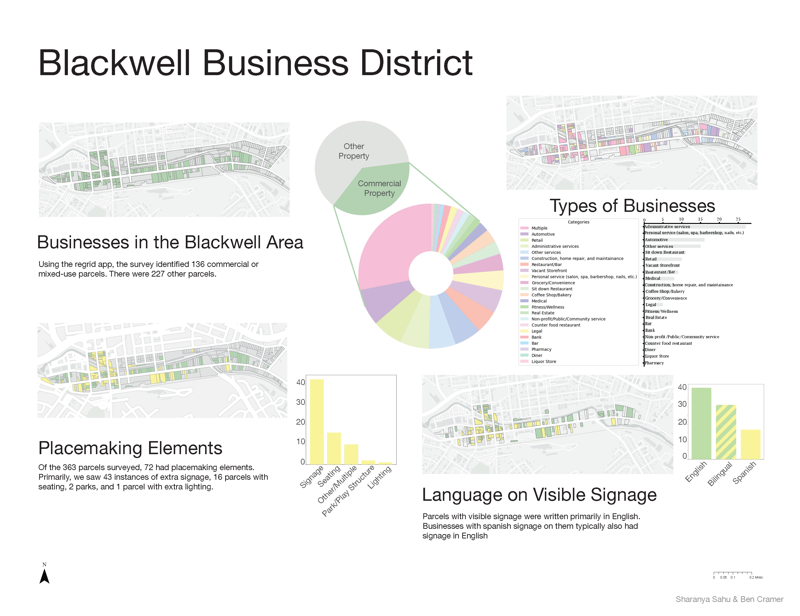

# Neighborhood Planning for Dover, New Jersey

  <a href="index.html">About Me</a>
  <a href="https://docs.google.com/document/d/e/2PACX-1vTdXMOxjDVlwPxPEMZ2_DTfDJnAC52xALzhIjLUhGW5FnHeF41MyVcPV0RUxzgMhcjNPmRNMxvVOgRB/pub">Resume</a>
  <a href="project.html">Projects</a>
  <a href="paper.html">Papers</a>
  <a href="awards.html">Awards</a>
  <a href="contact.html">Contact</a>

I worked alongside Jason Rowe, Elena Peeples, and Ben Cramer on neighborhood planning through the Department of Community Affairs’ Neighborhood Revitalization Tax Credit (NRTC) program, which enables private sector investment in community development. I helped kick off the engagement process for a new neighborhood revitalization plan in a vibrant New Jersey community, and contributed to census data analysis, outreach, parcel surveying, and strategy development for the plan. Strategic Communities also works to implement a diverse array of other neighborhood revitalization plans, for which I helped prepare grant applications.

We surveyed the business district using Regrid as part of our analysis, and used Python, ArcGIS Pro, and Adobe Illustrator to showcase our findings:

Here is my final report:
<iframe src="pdf/Dover_Section_7.pdf" width="100%" height="600px"></iframe>

 
Thank you for visiting my webpage. If you are interested in collaborating, please feel free to [reach out](contact.md)!
